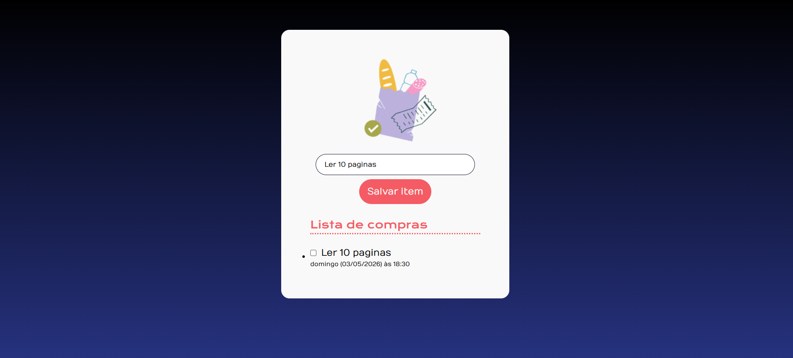

# 🛒 Lista de Compras

Uma pequena aplicação web para criar uma lista de compras dinâmica, marcando itens como concluídos e exibindo a data e hora em que o item foi adicionado.

## ✨ Funcionalidades

- Adicionar itens na lista de compras
- Marcar itens como concluídos com checkbox
- Exibir data e hora atual para cada item adicionado
- Mostrar mensagem quando a lista estiver vazia

---

## 🚀 Como usar

1. Abra `index.html` no navegador.
2. Digite o nome do item no campo de entrada.
3. Clique em **Salvar item**.
4. O item será adicionado à lista com a data e hora do momento.
5. Marque a caixa para riscar o item e indicar que ele foi concluído.

---

## 🧠 Estrutura do projeto

```bash
lista-de-compras
├── img/                                 # Imagens usadas na interface
├── script/
      └── script/criarItemDaLista.js     # Cria o elemento de item da lista e adiciona data/hora
      └── script/verificarListaVazia.js  # Controla a mensagem de lista vazia
      └── script/gerarDiaDaSemana.js     # Gera a data atual em formato legível
├── index.html -                         # Layout principal da aplicação
├── index.js lógica                      # Principal de interação e eventos
├── styles.css                           # Estilos visuais e aparência
```

---

## 📷 Preview



---


## 🛠️ Tecnologias

- HTML
- CSS
- JavaScript (ES Modules)

---

## 💡 Observações

- Caso o campo esteja vazio, o aplicativo exibe um alerta pedindo para inserir um item.
- A data é exibida no formato `dia da semana (dd/mm/aaaa) às hh:mm`.

## 🤝 Contribuição

Sinta-se à vontade para contribuir com melhorias. Abra uma issue ou envie um pull request.

---

## 📄 Licença

Este projeto é fictício e para fins educacionais.